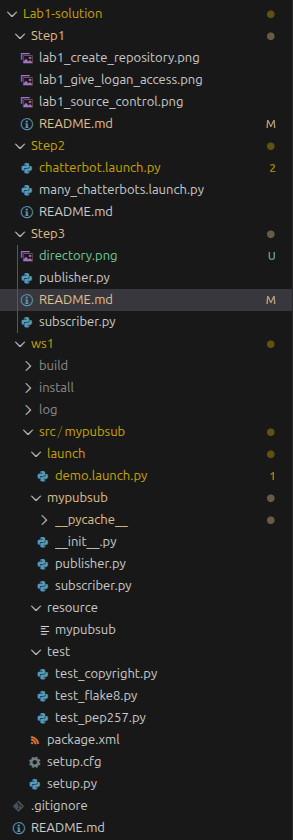

# Step 3: Introduction to ROS Packages (Python)

In this tutorial, you will learn how to
* Create a ROS workspace
* Create a ROS package
* Write a ROS node in Python to publish to a topic
* Write a ROS node in Python to listen to a topic
* Add a launch script to your package.

This tutorial is based on the official ros tutorial [here](https://docs.ros.org/en/humble/Tutorials/Beginner-Client-Libraries/Writing-A-Simple-Py-Publisher-And-Subscriber.html).

## ROS Workspace

All ROS packages need to live a ROS workspace, which is just a folder with a particular structure. For this class, we will create one workspace per lab assignment. Now, do the following:
```bash
cd ~/ece569-spring2026/Lab1
mkdir -p ws1/src
```
The `src` folder will hold all of the source code for your workspace. Now let's create our first package.

## ROS Package

We will create a package with two nodes: a talker (publisher) and a listener (subscriber). We will call this package `mypubsub`.

Create a new package in the `src` folder:
```bash
cd ws1/src
ros2 pkg create --build-type ament_python mypubsub
```
*It is critical that you create the package in the `src` folder!* Verify the package was created where you expected using the `tree` command:
```bash
cd ~/ece569-spring2026/Lab1/ws1
tree
```
You should get an output like the following:
```
.
└── src
    └── mypubsub
        ├── package.xml
        ├── mypubsub
        │   └── __init__.py
        ├── resource
        │   └── mypubsub
        ├── setup.cfg
        ├── setup.py
        └── test
            ├── test_copyright.py
            ├── test_flake8.py
            └── test_pep257.py

6 directories, 8 files
```
Finally, build the package with the following command. (You _always always always_ build from the `ws1` folder and _never_ from the `src` folder. If you ever build from the wrong folder you will need to delete all the misplaced `build/` `install/` and `log/` folders - otherwise you will have issues with ROS knowing where to look for the executables.)
```bash
cd ~/ece569-spring2026/Lab1/ws1
colcon build --symlink-install
source install/setup.bash
```
Run the `tree -d -L 2` command now to see the new structure of your workspace! The `build`, `install`, and `log` folders have been automatically created on the same level as the `src` folder, (_not inside the `src` folder!_).
```
.
├── build
│   └── mypubsub
├── install
│   └── mypubsub
├── log
│   ├── build_2025-08-12_09-38-42
│   ├── build_2025-08-12_10-11-59
│   ├── build_2025-08-12_10-12-15
│   ├── build_2025-08-12_10-12-36
│   ├── latest -> latest_build
│   └── latest_build -> build_2025-08-12_10-12-36
└── src
    └── mypubsub
```

## Common ROS2 Mistakes and Pitfalls

Again, the __most common mistake when learning ros2__ is running `colcon build --symlink-install` in the wrong location on the command line. You should only run this command when you are in the workspace folder (e.g., `ws1` for Lab 1). If you run `colcon build` in the wrong folder, new folders called build, install, and log will be created at the wrong location. You will need to carefully delete the improperly located folders by navigating to where you last ran `colcon build`  and then running `rm -rf build install log`. Also remember that you can view your working directory with `pwd` and list the contents of your working directory with `ls`.

If you are ever confused, you can compare your directory structure with mine. The image below is what your solution should look like when you are done with Lab 1. The structure of your workspace folder `ws1` will also be consistent with Lab 2, 3, and 4.


The __second most common mistake__ is forgetting to source your workspace with `source install/setup.bash`. Always run this command directly after using `colcon build`. A common error message that you will see if you forget to source your workspace is shown below:
```
Package 'mypubsub' not found: "package 'mypubsub' not found, searching: ['/opt/ros/jazzy']"
```

Finally, if you ever see the error message 
```
ros2: command not found
```
then that means that your terminal has not properly run the command `source /opt/ros/jazzy/setup.bash` (or humble instead of jazzy, if applicable). If this happens then it most likely means that you didn't include the above command in your `~/.bashrc` file.

## Create Publisher

Copy and paste the `publisher.py` code into the `src/mypubsub/mypubsub` folder (which contains `__init__.py`):
```bash
cd ~/ece569-spring2026/Lab1/ws1/src
cp ../../Step3/publisher.py ./mypubsub/mypubsub/
```
Now we must add some dependencies:

1) In the `package.xml` file, add the following lines between the `</license>` and `<test_depend>` tags:
```xml
  <exec_depend>rclpy</exec_depend>
  <exec_depend>std_msgs</exec_depend>
```
*These python modules (`rclpy` and `std_msgs`) are imported in the `publisher.py` script, which is why they are needed here.*

2) In the `setup.py` file, modify the `entry_points` as follows:
```python
    entry_points={
        'console_scripts': [
            'publisher = mypubsub.publisher:main',
        ],
    },
```
and be sure the indentation levels are consistent. This allows us to call the `main()` function in the `publisher.py` file when we run `ros2 run mypubsub publisher` later.

3) Build the package with
```bash
cd ~/ece569-spring2026/Lab1/ws1
colcon build --symlink-install
```

4) Source the workspace by running: 
```bash
cd ~/ece569-spring2026/Lab1/ws1
source install/setup.bash
```
_Note: sourcing your workspace is a common occurrence when you are creating ros packages. If ros can't find your package or launch file, chances are you need to just source your workspace again._


### Operation

You can run your publisher using the command
```bash
ros2 run mypubsub publisher
```
You should check the node name and topic name using `ros2 node list` and `ros2 topic list`.

---

### Task 3.1

Modify the `publisher` node's code so that its node name is `<your-first-name>_publisher` (e.g. `logan_publisher` instead of `minimal_publisher`) and publishes to the topic `chatter` (instead of `my_topic`). Also replace the string `Hello World` with something more creative. Start your publisher node, and verify that 
```bash
ros2 run demo_nodes_cpp listener
```
can hear your messages. 

Take a screenshot the terminal running the `listener` node for your lab report.

_The point of this exercise is to get you familiar with editing Python code and building ROS packages. While you can use the command line to change the node and topic names, I want you to get practice changing Python code in order to change the functionality of your ROS package._

*Tip: because you didn't create any new files and we already built the package with the `--symlink-install` flag, you don't actually need to rebuild the package for this task. The `--symlink-install` flag is handy for making modifications to existing files without the need to rebuild the entire package. This feature is especially when working with very large packages.*

---

## Create a Listener

Copy the `subscriber.py` starter code into the same directory as `publisher.py`. Because the import statements don't depend on any additional modules, the `package.xml` file can be left alone. However, we will have to add a new entry point in `setup.py`:
```python
    entry_points={
        'console_scripts': [
            'publisher = mypubsub.publisher:main',
            'subscriber = mypubsub.subscriber:main',
        ],
    },
```
Then, build the package with:
```bash
cd ~/ece569-spring2026/Lab1/ws1
colcon build --symlink-install
```
*(This is necessary because we created new files in our package.)*

---

### Task 3.2

Change the subscriber node name to `<your-first-name>_subscriber` and the topic to `chatter`. Change the `I heard: ` message to something more creative (by editing the Python code). Build your package and source the workspace. Run your `publisher` and `subscriber` nodes at the same time from different terminals, and verify they can here each other!

Take a screenshot of the terminal with the `subscriber` node running for your lab report.

---

## Quality of Life Upgrades for ROS Development

Many ROS commands are long and repetitive, and it is easy to forget to source your workspace after building. You can use environment variables and `alias` commands to make your life a little easier (and avoid the age-old problem of running `colcon build` from the wrong directory!). Add the following to your `.bashrc` file. (This will save you many headaches throughout the semester. 

```bash
export ROS_WS=~/ece569-spring2026/Lab1/ws1 # set the current workspace (no quotes!)
alias rosd='cd $ROS_WS'      # change to ws1 directory
alias rosds='cd $ROS_WS/src' # change to ws1/src directory
alias _ws='rosd && source install/setup.bash'
alias cb='rosd && colcon build --symlink-install && _ws' # build from correct directory and source
alias rosclean='rosd && rm -rf build/ install/'   # remove all build install and logs the workspace
```

Please add this to your `.bashrc` file now, as we will use these short-hand commands in future labs! The reason I had you practice the long-form versions of the commands is so you can understand what articles on the internet mean when they say build and source your workspace.

Play around with these commands. If there are other commands you find doing a lot, consider writing an alias to make your life a little bit easier. I will be using them for the remainder of the course.

Pro Tip: You can permanently change the workspace where these commands apply by editing the `.bashrc` file, or temporarily change it to your current folder by running the following command.
```bash
export ROS_WS=$(pwd)
```

## Adding Launch files to your Package

You already learned how to create a launch file in Step 2 of this lab. Now you will learn how to add this launch script into your package. This tutorial is based off the [official tutorial here](https://docs.ros.org/en/humble/Tutorials/Intermediate/Launch/Launch-system.html) which you might want to read later.


All launch files live in the `launch` folder. Create one now.
```bash
rosds # cd into the ws1/src directory
mkdir -p mypubsub/launch
tree -L 2
```
Verify you have the following directrory structure:
```
.
└── mypubsub
    ├── launch
    ├── mypubsub
    ├── package.xml
    ├── resource
    ├── setup.cfg
    ├── setup.py
    └── test

6 directories, 3 files
```

Add the following import statements in `setup.py`:
```python
import os
from glob import glob
```
Add this line of code to the `data_files` list in `setup.py` (make sure you have the correct indentation):
```python
(os.path.join('share', package_name, 'launch'), glob('launch/*')),
```

---

### Task 3.3

Create a launch file called `demo.launch.py` which creates a `publisher` and `subscriber` node. Use the `Step2/chatterbot.launch.py` code as a template. You are not required to remap their node names or the topic names. Build and source your package.

Launch your demo using the command:
```bash
ros2 launch mypubsub demo.launch.py 
```

Take a screenshot that contains the contents of your `demo.launch.py` file and the terminal output of the command above to include in your lab report.

---

## Next Steps

You have finished all of the tasks for Lab 1. At this point, you should commit and push all of your code from the `ws1/src` folder. Then, you can begin typing up your lab report.
